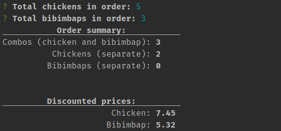

# Gotsu Calculator

Here at [Progmatic](https://progmatic.ee) we (too) often order lunch from [Gotsu](https://gotsu.ee) through [Wolt](https://wolt.com/en/est/tallinn/restaurant/gotsu).
For a long time there has been an offer there where you can get a combo of their chicken and bibimbap for quite a nice discount.

However, there usually isn't a 1:1 demand for both of those. This brings the question, of how to fairly distribute the savings?

This tool allows you to input the number of orders for both the chicken and bibimbap. It then calculates the total savings for both meals separately and divides it between people who ordered it. So if there are 3 people who order chicken and only 2 who order bibimbap, the people who ordered bibimbap receive the full discount and the people who chose chicken split up the savings.

## Setup

1. Clone this repository
2. Run `npm install`
3. Configure the prices (see below)

## Configuration

There is a `config/default.json` file where you can adjust the prices. Default prices are already included.

## Usage

1. Run the tool using `node index.js`
2. Enter the amount of chickens and bibimbaps ordered.
3. ????
4. Profit

### Bonus: using this with Splitwise

When using splitwise, split the amount by shares and enter the discounted prices as the share amounts. If someone orderes something else from the menu you can enter its price as the share amount too. This way all the service fees and stuff get split up as well.

